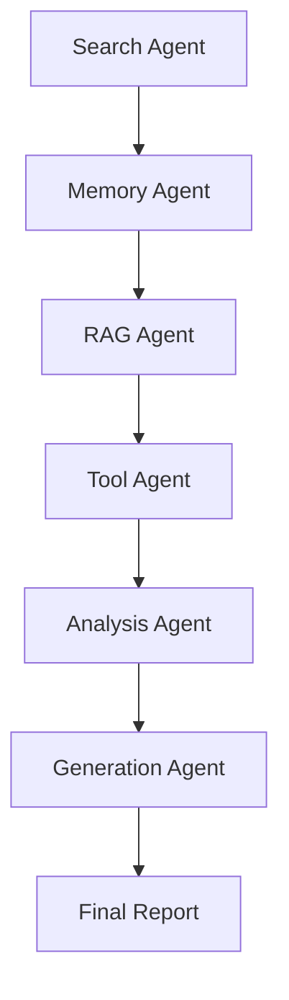

# Multi-Agent Research Automation
> Intelligent research platform using collaborative AI agents with RAG capabilities and LangGraph orchestration

[](https://www.python.org/downloads/)
[](https://fastapi.tiangolo.com)
[](https://streamlit.io)
[](https://github.com/langchain-ai/langgraph)
[](https://www.trychroma.com/)

## 🚀 Overview

The Multi-Agent Research Automation platform is a sophisticated research system that leverages specialized AI agents working collaboratively to conduct comprehensive research, analyze findings, and generate detailed reports. Built with modern Python frameworks and enterprise-grade architecture patterns, it combines traditional web search with advanced RAG (Retrieval-Augmented Generation) capabilities.

### ✨ Key Features

- **🤖 Multi-Agent Architecture**: Six specialized AI agents working in orchestrated workflows
- **📚 RAG Integration**: Advanced document ingestion and retrieval-augmented generation
- **🧠 Memory System**: Persistent research history with contextual analysis
- **🔍 Multi-Source Research**: Wikipedia, ArXiv, Tavily, and custom document search
- **⚡ High Performance**: Optimized workflows with parallel processing capabilities
- **🔧 Production Ready**: FastAPI backend with comprehensive testing and monitoring
- **📊 Real-Time Analytics**: Research workflow tracking and performance metrics

### 🏗️ Architecture

```
┌─────────────────┐    ┌─────────────────┐    ┌─────────────────┐
│   Streamlit     │    │   FastAPI       │    │   Docker        │
│   Frontend      │◄──►│   Backend       │◄──►│   Container     │
└─────────────────┘    └─────────────────┘    └─────────────────┘
         │                       │                       │
         ▼                       ▼                       ▼
┌─────────────────┐    ┌─────────────────┐    ┌─────────────────┐
│   LangGraph     │    │   ChromaDB      │    │   Agent         │
│   Workflow      │◄──►│   Vector Store  │◄──►│   Orchestration │
└─────────────────┘    └─────────────────┘    └─────────────────┘
```

## 🚀 Quick Start

### Prerequisites

- Python 3.11+
- Docker & Docker Compose (optional)
- Groq API Key
- Tavily API Key (optional)

### 1. Clone Repository

```bash
git clone <repository-url>
cd multi-agent-research-automation
```

### 2. Environment Setup

```bash
# Create virtual environment
python -m venv .venv

# Activate virtual environment
# Windows
.venv\Scripts\activate
# Linux/Mac
source .venv/bin/activate

# Install dependencies
pip install -r requirements.txt
```

### 3. Configuration

Create a `.env` file in the root directory:

```env
GROQ_API_KEY=your_groq_api_key_here
TAVILY_API_KEY=your_tavily_api_key_here  # Optional
SECRET_KEY=your_secret_key_here
```

### 4. Run Development Server

#### Option A: Streamlit Application (Recommended for Quick Start)

```bash
streamlit run streamlit_app.py
```

#### Option B: FastAPI Backend + Frontend

```bash
# Terminal 1: Start FastAPI backend
uvicorn api.main:app --reload --port 8000

# Terminal 2: Start Streamlit frontend (if using separate frontend)
streamlit run streamlit_app.py --server.port 8501
```

### 5. Access Application

- **Streamlit Dashboard**: http://localhost:8501
- **API Documentation**: http://localhost:8000/docs (if running FastAPI)
- **API Health Check**: http://localhost:8000/health

## 🐳 Docker Deployment

### Development

```bash
# Build and run with Docker Compose
docker-compose up -d

# View logs
docker-compose logs -f
```

### Production

```bash
# Set environment variables
export GROQ_API_KEY=your_key
export TAVILY_API_KEY=your_key
export SECRET_KEY=your_secret

# Deploy
docker-compose up -d --build

# Monitor
docker-compose logs -f api
```

## 🤖 Agent System

### Specialized Agents

| Agent | Role | Capabilities |
|-------|------|-------------|
| **Search Agent** | Initial Research & Query Processing | Web search simulation, query refinement, information gathering |
| **Memory Agent** | Context & History Management | Research history analysis, contextual insights, knowledge continuity |
| **RAG Agent** | Document Retrieval & QA | Document ingestion, vector search, context-aware responses |
| **Tool Agent** | External Source Integration | Wikipedia search, ArXiv papers, Tavily web search |
| **Analysis Agent** | Data Analysis & Pattern Recognition | Cross-source analysis, insight extraction, gap identification |
| **Generation Agent** | Report Creation & Synthesis | Academic writing, structured reports, comprehensive synthesis |

### Workflow Patterns



- **Sequential Processing**: Step-by-step agent execution with cumulative data
- **Memory Integration**: Historical context analysis for better insights
- **RAG Enhancement**: Document-based knowledge augmentation
- **Multi-Source Synthesis**: Integration of various information sources

## 📊 API Reference

### Research Endpoints

#### Execute Research Query
```http
POST /api/v1/research/query
Content-Type: application/json

{
  "query": "artificial intelligence in healthcare",
  "mode": "full",  // or "rag_only"
  "debug": false,
  "max_tokens": 4000
}
```

#### Health Check
```http
GET /api/v1/research/health
```

### Document Management

#### Upload Documents
```http
POST /api/v1/documents/upload
Content-Type: multipart/form-data

files: [file1.pdf, file2.docx, ...]
```

#### Ingest URLs
```http
POST /api/v1/documents/ingest-urls
Content-Type: application/json

{
  "urls": ["https://example.com/article1", "https://example.com/article2"]
}
```

#### Vector Store Statistics
```http
GET /api/v1/documents/stats
```

### Memory Management

#### Get Memory Entries
```http
GET /api/v1/memory/entries?limit=10&offset=0
```

#### Analyze Memory Context
```http
POST /api/v1/memory/analyze
Content-Type: application/json

{
  "query": "research topic to analyze"
}
```

## 📚 Document Processing

### Supported Formats

- **PDF**: Text extraction with PyPDF2
- **DOCX**: Microsoft Word documents
- **TXT**: Plain text files
- **URLs**: Web content extraction

### RAG Configuration

```yaml
vector_store:
  provider: "chroma"
  collection_name: "research_documents"
  embedding_model: "all-MiniLM-L6-v2"
  chunk_size: 1000
  chunk_overlap: 200
  persist_directory: "./data/vector_store"
  
  retrieval:
    top_k: 5
    similarity_threshold: 0.7
    max_context_tokens: 4000
    rerank: true
```

## 🔧 Configuration

### Environment Variables

| Variable | Description | Required |
|----------|-------------|----------|
| `GROQ_API_KEY` | Groq API key for LLM access | Yes |
| `TAVILY_API_KEY` | Tavily API key for web search | No |
| `SECRET_KEY` | Application secret key | Yes |
| `API_HOST` | API host (default: 0.0.0.0) | No |
| `API_PORT` | API port (default: 8000) | No |

### Tool Configuration

```yaml
tools:
  enable_wikipedia: true
  enable_tavily: true
  enable_arxiv: true
  enable_rag: true
```

## 🧪 Testing

### Run Tests

```bash
# Run all tests
pytest

# Run specific test file
pytest tests/test_rag.py -v

# Run with coverage
pytest --cov=src tests/
```

### API Testing

```bash
# Test API endpoints
pytest tests/api/ -v

# Load testing (if implemented)
locust -f tests/load_test.py --host=http://localhost:8000
```

## 📁 Project Structure

```
multi-agent-research-automation/
├── api/                    # FastAPI backend
│   ├── main.py            # Application entry point
│   ├── routers/           # API route handlers
│   ├── models/            # Pydantic models
│   └── middleware/        # Custom middleware
├── src/                   # Core application code
│   ├── agent/            # AI agent implementations
│   ├── config/           # Configuration management
│   ├── prompt_library/   # LLM prompts
│   ├── rag/              # RAG system components
│   ├── tools/            # External tool integrations
│   ├── utils/            # Utility functions
│   └── workflow/         # LangGraph workflows
├── tests/                # Test suite
├── data/                 # Data storage directory
├── logs/                 # Application logs
├── streamlit_app.py      # Streamlit frontend
├── docker-compose.yml    # Docker configuration
├── requirements.txt      # Python dependencies
└── README.md            # This file
```

## 🚀 Deployment

### Local Development

1. Clone repository
2. Set up environment
3. Configure API keys
4. Run with `streamlit run streamlit_app.py`

